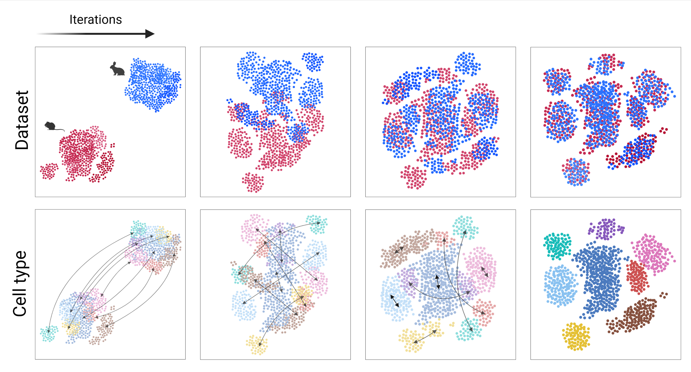

# Rsatsne

This R package implements the SATSNE method for integrating single-cell data.




## Installation

``` r
# Inside R session
devtools::install_github("https://github.com/dkeitley/Rsatsne")
```

## Usage

SATSNE aligns datasets represented as `SingleCellExperiment` objects.

``` r
out <- Rsatsne::runSATSNE(A_data, B_data, shared_feats, verbose = TRUE)
```

The output of SASTE is a list containing the integrated embedding coordinates of each dataset.

## Acknowledgments

SATSNE was conceptualised by [Laleh Haghverdi](https://github.com/LalehHaghverdi/) in a project supervised by John Marioni and Wolfgang Huber. The Rsatsne implementation makes heavy use of [Rtsne](https://github.com/jkrijthe/Rtsne) and [batchelor](https://bioconductor.org/packages/devel/bioc/html/batchelor.html) packages.
